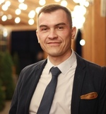

# PIATROU ALIAKSANDR

 

> **_Make it on your own, and no one can take it away from you_**  

---  

## ABOUT ME

Belarus, male, 37

I like the field of IT and everything associated with it. I have recently become interested in programming and started with learning the basics of HTML, CSS and JS. I aspire to get knowledge, which will help me to get a real job in IT sphere to get practical experience and realization of myself in this sphere  

---

## CONTACTS

e-mail: <sasha.petrov@tut.by>  
skype: pitbrest  
discord: pitbrest(@pitbrest)  
github: [pitbrest](/pitbrest)  
location: [Brest, Belarus](https://goo.gl/maps/ptAL4TB4n6LXx82E7)

---

## EDUCATION

- 2010 - Belarusian National Technical University (engineer of metrology, standardization and certification)
- 2016 - Brest State Technical University (civil engineer)
- 2022 - The Rolling Scopes School (JavaScript/Front-end. Stage 0)    

---